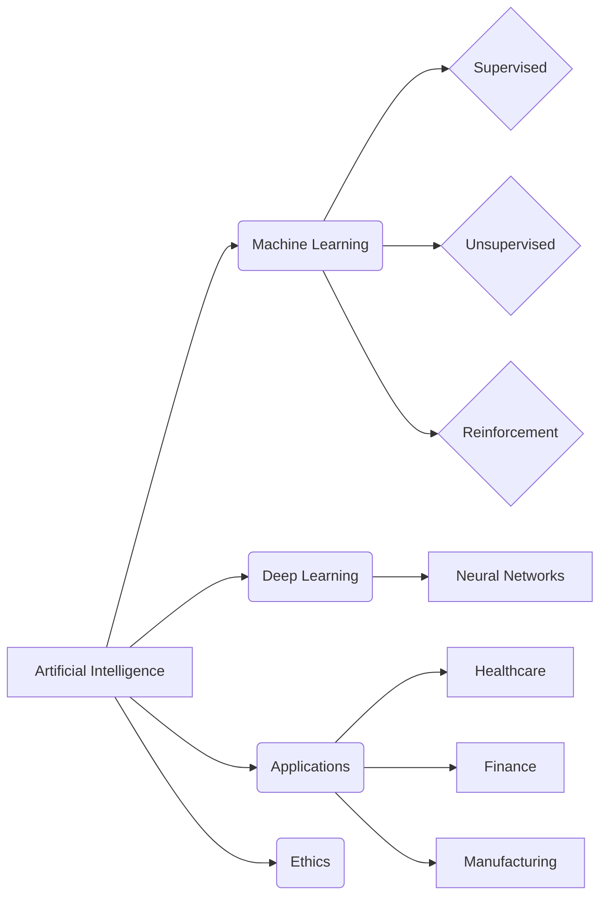

# Document Analysis Summary

**Language**: English

## Summary

This document provides a brief overview of Artificial Intelligence (AI), including its definition, core concepts like machine learning and deep learning, applications across various sectors, and potential benefits and risks. It emphasizes the transformative impact of AI while acknowledging the ethical considerations surrounding its development and deployment.

## Keywords

- **Artificial Intelligence** (relevance: 1.00)
- **AI** (relevance: 0.90)
- **Machine Learning** (relevance: 0.80)
- **Deep Learning** (relevance: 0.70)
- **Neural Networks** (relevance: 0.70)
- **Algorithms** (relevance: 0.60)
- **Data** (relevance: 0.60)
- **Automation** (relevance: 0.50)
- **Ethics** (relevance: 0.50)
- **Risks** (relevance: 0.40)

## Named Entities

*No entities extracted*

## Document Structure

- **Introduction to AI**
  Defines AI and its scope.
- **Core Concepts of AI**
  Explains machine learning, deep learning, and neural networks.
- **Applications of AI**
  Covers various sectors utilizing AI.
- **Benefits and Risks of AI**
  Discusses the potential positive and negative impacts of AI.
- **Ethical Considerations**
  Highlights the ethical dilemmas related to AI development.

## Optimization Suggestions

### Content

**Issue:** The document lacks specific examples of AI applications.

**Suggestion:** Include concrete examples of AI in healthcare, finance, etc., to enhance understanding.

### Content

**Issue:** The discussion on risks is quite general.

**Suggestion:** Elaborate on specific risks like job displacement, algorithmic bias, and security concerns.

### Structure

**Issue:** A conclusion summarizing the key takeaways is missing.

**Suggestion:** Add a concluding section to reinforce the main points and provide a future outlook.

## Document Diagrams

### AI Overview

A flowchart representing the key concepts and relationships within AI.

